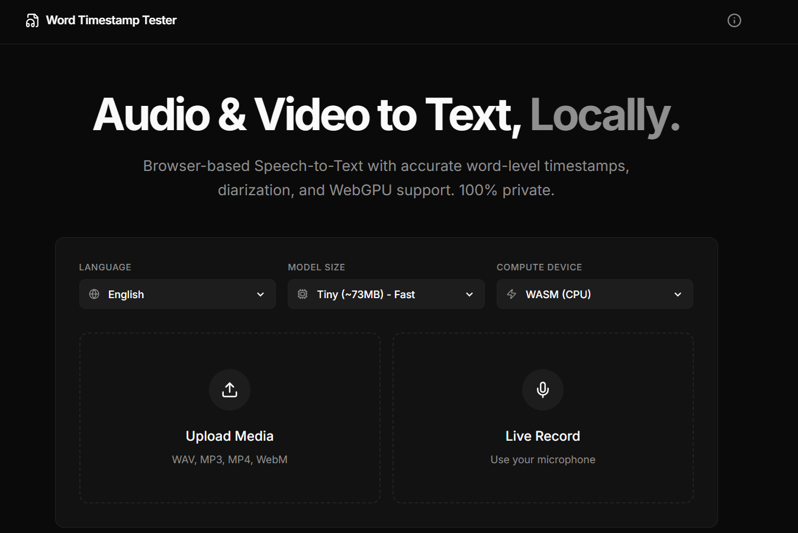

<div align="center">
  <h1 align="center">Whisper Web Scribe</h1>
  <p align="center">
    <strong>100% Free & Browser-based Speech-to-Text with exact word-level timestamps, diarization, and WebGPU support. Fully private.</strong>
  </p>
  <p align="center">
    <a href="https://whisper-web-scribe.vercel.app"><b>✨ View Live Demo ✨</b></a>
  </p>
</div>

---

## 🚀 Overview

**Whisper Web Scribe** is a powerful, locally-running transcription tool built with React and [Transformers.js](https://huggingface.co/docs/transformers.js/index). By tapping into Web Workers and WebGPU, it downloads the AI model to your browser once and processes all your audio locally.

No backend. No subscriptions. Completely private.

### 📸 Screenshots




## ✨ Key Features

- **💸 100% Free Forever**: No backend costs, no API keys needed, and absolutely no subscriptions.
- **🔒 100% Private Data**: Your audio/video files never leave your device. All inference is processed client-side.
- **⏱️ Word-Level Timestamps**: Click any transcribed word to seek instantly to that exact moment in the audio.
- **🎤 Karaoake Mode**: An immersive, auto-scrolling UI to follow along seamlessly as audio plays.
- **👥 Basic Diarization**: Heuristic-based speaker detection separates transcripts by speakers based on conversational pauses.
- **💾 Export Anything**: Download your transcripts in `JSON`, `SRT`, or `VTT` formats with an immediate copy-to-clipboard option.
- **⚡ WebGPU & WASM**: Hardware-accelerated transcription right in your browser.
- **🌍 Multi-language**: Supports English, Turkish, Spanish, French, German, and Italian natively.

## 🛠️ Tech Stack

- **Framework**: [React 19](https://react.dev/) + [Vite](https://vitejs.dev/)
- **AI/ML Engine**: [Transformers.js](https://github.com/huggingface/transformers.js) (`Xenova/whisper-tiny`, `base`, `small`)
- **Styling**: [Tailwind CSS v4](https://tailwindcss.com/)
- **Animation**: [Motion](https://motion.dev/)
- **Icons**: [Lucide React](https://lucide.dev/)

## 💻 Getting Started (Local Development)

### Prerequisites
- Node.js (v18+)
- npm or pnpm

### Installation

1. Clone the repository:
   ```bash
   git clone https://github.com/ozguradmin/whisper-web-scribe.git
   cd whisper-web-scribe
   ```

2. Install dependencies:
   ```bash
   npm install
   ```

3. Start the development server:
   ```bash
   npm run dev
   ```

4. Open your browser and navigate to `http://localhost:3000`.

## 🌐 Deployment

The project is configured as a static application and is currently deployed on **Vercel**. 
To deploy your own instance, simply connect your GitHub repository to Vercel and use the default Vite build settings (`npm run build`, output dir: `dist`).

## 📄 License

This project is licensed under the MIT License - see the LICENSE file for details.

---

<p align="center">
  Developed by <a href="https://github.com/ozguradmin">@ozguradmin</a>
</p>
